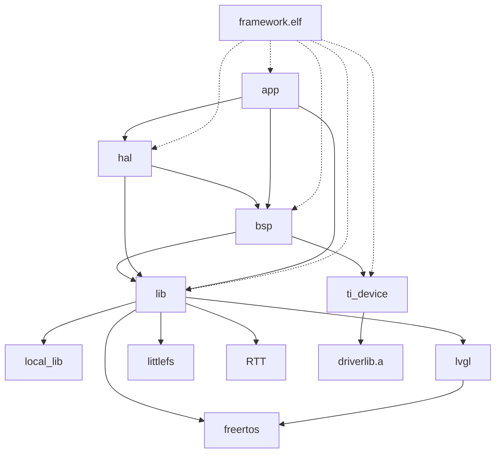

# MSPM0G3507 Framework

一个用于 TI MSPM0G3507 微控制器的嵌入式框架，采用分层架构设计，集成 FreeRTOS 实时操作系统、LVGL 图形库、LittleFS 文件系统和 TI DriverLib。

- [MSPM0G3507 Framework](#mspm0g3507-framework)
  - [项目概述](#项目概述)
  - [快速开始](#快速开始)
  - [架构分层](#架构分层)
  - [功能特性与模块文档](#功能特性与模块文档)
    - [HAL 驱动](#hal-驱动)
    - [BSP 外设](#bsp-外设)
    - [应用模块](#应用模块)
    - [库](#库)
    - [测试模块](#测试模块)
  - [项目结构](#项目结构)
  - [配置系统](#配置系统)
  - [构建输出](#构建输出)
  - [文档导航](#文档导航)
  - [代码风格](#代码风格)
  - [参考资源](#参考资源)

## 项目概述

| 微控制器 | 内核 | 主频 | Flash | SRAM |
| --- | --- | --- | --- | --- |
| MSPM0G3507 | ARM Cortex-M0+ | 32 MHz | 128 KB | 32 KB |

基于 CMake + Ninja 构建，支持 Linux / Windows 主机开发。

## 快速开始

```bash
cd framework
mkdir -p build && cd build
cmake -G Ninja ..
ninja -j$(nproc)

# 或使用脚本
./scripts/cm.bash
```

详细编译指南见 [`docs/build.md`](docs/build.md)。

## 架构分层



| 层级 | 目录 | 职责 | 详细文档 |
| --- | --- | --- | --- |
| **应用层** | `src/app/` | 业务逻辑：Flash 远程管理、LittleFS 适配 | [`docs/app.md`](docs/app.md) |
| **HAL** | `src/hal/` | 硬件驱动抽象：LED、按键、摇杆、蜂鸣器、LCD、Flash、串口、以太网 | [`docs/hal.md`](docs/hal.md) |
| **BSP** | `src/bsp/` | 板级支持：GPIO、PWM、ADC、SPI、UART、时基 | [`docs/bsp.md`](docs/bsp.md) |
| **库层** | `lib/` | FreeRTOS、LVGL、LittleFS、RTT、通用工具 | [`docs/lib.md`](docs/lib.md) |
| **设备层** | `ti_device/` | CMSIS、启动文件、DriverLib、链接脚本 | — |
| **测试** | `src/test/` | 外设测试子系统 | [`docs/test.md`](docs/test.md) |
| **配置** | `config/` | 构建开关、板级映射、内核配置 | [`docs/config.md`](docs/config.md) |
| **构建** | `cmake/` `scripts/` | CMake + Ninja 交叉编译 | [`docs/build.md`](docs/build.md) |

## 功能特性与模块文档

### HAL 驱动

| 模块 | 说明 | 依赖 |
| --- | --- | --- |
| `led_simple` | 简易 LED 开关/闪烁 | GPIO |
| `led_breath` | PWM 呼吸灯 | PWM |
| `button` | GPIO 按键 + 去皮抖 | GPIO |
| `joystick` | 双通道 ADC 摇杆 | ADC |
| `buzzer` | PWM 蜂鸣器 + 内置曲目库 | PWM |
| `st7789` | ST7789V LCD 驱动（240×240） | SPI、GPIO |
| `w25q32` | W25Q32JV SPI NOR Flash（4 MiB） | SPI、GPIO |
| `com_uart` | 协议化串口通信（多协议栈） | UART |
| `com_udp` | 以太网 UDP 通信 | W5500 |
| `w5500` | Wiznet W5500 以太网控制器 | SPI |

详见 [`docs/hal.md`](docs/hal.md)。

### BSP 外设

| 模块 | 说明 |
| --- | --- |
| `gpio` | 数字 I/O（读写、翻转） |
| `pwm` | PWM 输出（占空比/频率） |
| `adc` | ADC 采集（含 DMA） |
| `spi` | 硬件 SPI + 软件 SPI |
| `uart` | UART + DMA + 空闲中断连续接收 |
| `time` | 毫秒级时基 |

详见 [`docs/bsp.md`](docs/bsp.md)。

### 应用模块

| 模块 | 说明 | 控制宏 |
| --- | --- | --- |
| `flash_mgr` | Flash 远程管理（UART 协议） | `FLASH_MGR_ENABLE`（`flash_mgr.h`） |
| `lfs_port` | LittleFS 块设备适配（W25Q32） | `FRAMEWORK_USE_LFS` |

详见 [`docs/app.md`](docs/app.md)。

### 库

| 库 | 说明 | 控制宏 |
| --- | --- | --- |
| FreeRTOS | 实时操作系统（v11.x） | `FRAMEWORK_USE_FREERTOS` |
| LVGL | 嵌入式图形库（v9.5） | `FRAMEWORK_USE_LVGL` |
| LittleFS | 嵌入式文件系统 | `FRAMEWORK_USE_LFS` |
| RTT | SEGGER 实时传输日志 | `FRAMEWORK_USE_RTT` |
| Wiznet | W5500 以太网驱动 | `FRAMEWORK_USE_WIZNET` |
| local_lib | 动态数组、协议栈、CRC、堆封装 | 始终启用 |

详见 [`docs/lib.md`](docs/lib.md)。

### 测试模块

14 个外设/功能测试，通过 `config/test_config.h` 宏独立开关。详见 [`docs/test.md`](docs/test.md)。

## 项目结构

``` plain
framework/
├── cmake/                       # CMake 工具链与构建脚本
│   ├── toolchain.cmake          # ARM GCC 工具链
│   ├── tools.cmake              # SysConfig 生成
│   ├── lvgl_config.cmake        # LVGL 构建参数
│   └── utils.cmake              # 辅助函数
├── src/
│   ├── main.c                   # 系统入口（FreeRTOS 多任务）
│   ├── it.c                     # 中断服务例程
│   ├── app/                     # 应用层
│   │   ├── app.c/h              # App_Init / App_Task_Def
│   │   ├── flash_mgr/           # Flash 远程管理（UART 协议）
│   │   └── lfs_port/            # LittleFS 块设备适配
│   ├── bsp/                     # 板级支持包
│   │   ├── bsp.c/h              # Bsp_Init
│   │   ├── gpio/ adc/ pwm/      # GPIO / ADC / PWM
│   │   ├── spi/ uart/ time/     # SPI / UART / 时基
│   ├── hal/                     # 硬件抽象层
│   │   ├── hal.c/h              # Hal_Init / Hal_Task_Def
│   │   ├── led_simple/          # 简易 LED
│   │   ├── led_breath/          # 呼吸 LED
│   │   ├── button/              # 按键
│   │   ├── joystick/            # 摇杆
│   │   ├── buzzer/              # 蜂鸣器 + 曲库
│   │   ├── st7789/              # LCD 显示
│   │   ├── w25q32/              # SPI Flash
│   │   ├── com_uart/            # 协议化串口
│   │   ├── com_udp/             # UDP 通信
│   │   └── w5500/               # 以太网控制器
│   ├── test/                    # 测试子系统
│   └── syscall/                 # newlib retarget
├── lib/
│   ├── local_lib/               # 通用工具库（vector、protocol、crc）
│   ├── freertos/                # FreeRTOS v11.x
│   ├── lvgl/                    # LVGL v9.5
│   ├── lfs/                     # LittleFS
│   └── RTT/                     # SEGGER RTT
├── ti_device/                   # TI 设备支持（CMSIS / DriverLib / LD）
├── config/                      # 配置文件
│   ├── config.yaml              # 构建开关
│   ├── board_config.h           # 板级外设映射
│   ├── test_config.h            # 测试开关
│   ├── FreeRTOSConfig.h         # FreeRTOS 配置
│   ├── lvgl_config.h            # LVGL 配置
│   └── lfs_config.h             # LittleFS 配置
├── tools/                       # 工具链（ARM GCC / SysConfig）
├── scripts/                     # 构建与辅助脚本
├── docs/                        # 模块详细文档
│   ├── app.md                   # 应用层
│   ├── hal.md                   # 硬件抽象层
│   ├── bsp.md                   # 板级支持包
│   ├── lib.md                   # 库层
│   ├── test.md                  # 测试子系统
│   ├── config.md                # 配置系统
│   ├── build.md                 # 构建系统
│   ├── flash_uart_protocol.md   # Flash UART 协议说明
│   └── wiznet_w5500.md          # W5500 以太网说明
├── CMakeLists.txt               # 顶层 CMake
└── README.md
```

## 配置系统

[`docs/config.md`](docs/config.md)

特性开关通过 `config/config.yaml` 控制：

```yaml
FRAMEWORK_USE_FREERTOS: ON
FRAMEWORK_USE_RTT: ON
FRAMEWORK_USE_LVGL: OFF
FRAMEWORK_USE_LFS: ON
FRAMEWORK_USE_WIZNET: ON
```

板级引脚映射在 `config/board_config.h`，测试开关在 `config/test_config.h`。

> [!TIP]
> `FRAMEWORK_USE_LVGL=OFF` 时 LVGL 库不会被编译，可显著缩小固件体积。

## 构建输出

| 文件 | 说明 |
| --- | --- |
| `framework.elf` | ELF 可执行文件 |
| `framework.hex` | Intel HEX 固件 |
| `framework.bin` | 二进制固件 |
| `framework.map` | 链接地图 |
| `framework.dot` | 依赖关系图 |

## 文档导航

| 文档 | 内容 |
| --- | --- |
| [`docs/build.md`](docs/build.md) | 编译流程、工具链、构建脚本 |
| [`docs/config.md`](docs/config.md) | 配置系统（yaml、头文件、SysConfig） |
| [`docs/bsp.md`](docs/bsp.md) | BSP 外设驱动 API |
| [`docs/hal.md`](docs/hal.md) | HAL 硬件驱动 API |
| [`docs/app.md`](docs/app.md) | 应用层模块（flash_mgr / lfs_port） |
| [`docs/lib.md`](docs/lib.md) | 库层（FreeRTOS / LVGL / LittleFS / RTT） |
| [`docs/test.md`](docs/test.md) | 测试子系统 |
| [`docs/flash_uart_protocol.md`](docs/flash_uart_protocol.md) | Flash UART 协议帧格式 |
| [`docs/wiznet_w5500.md`](docs/wiznet_w5500.md) | W5500 以太网集成说明 |

## 代码风格

Clang Format（`.clang-format`）+ clangd（`.clangd`）。

## 参考资源

- [TI MSPM0G3507](https://www.ti.com/product/MSPM0G3507)
- [TI MSPM0 SDK](https://www.ti.com/tool/MSPM0-SDK)
- [TI SysConfig](https://www.ti.com/tool/SYSCONFIG)
- [FreeRTOS](https://www.freertos.org/Documentation/RTOS_book.html)
- [LVGL](https://docs.lvgl.io/)
- [LittleFS](https://github.com/littlefs-project/littlefs)
- [CMake](https://cmake.org/cmake/help/latest/)
- [ARM GCC](https://developer.arm.com/tools-and-software/open-source-software/developer-tools/gnu-toolchain)
