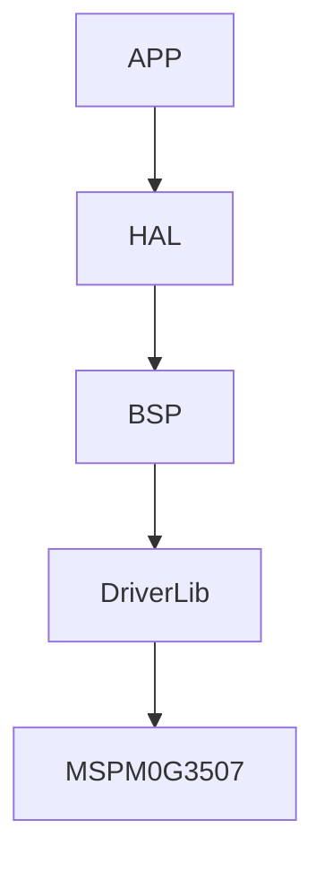

# MSPM0G3507 Framework

基于 TI MSPM0G3507 的嵌入式应用开发框架，采用 APP → HAL → BSP → DriverLib 分层架构。

| MCU | Core | Frequency | Flash | SRAM |
| --- | --- | --- | --- | --- |
| MSPM0G3507 | ARM Cortex-M0+ | 80 MHz | 128 KB | 32 KB |

## Architecture



单向依赖：上层调用下层，禁止反向。应用层代码在 ARM 硬件和 x86 SDL2 VM 上完全复用。

## Features

- FreeRTOS 实时内核（任务、队列、信号量、互斥锁）
- LVGL 图形库（可选），ST7789 LCD 驱动
- LittleFS 文件系统，W25Q32 SPI Flash，磨损均衡 + 掉电保护
- SEGGER RTT 调试日志，无需占用 UART
- SDL2 VM 仿真器，PC 上运行完整应用
- 多款内置游戏，菜单系统，高分榜，屏保

## Build

```bash
# 1. 编辑 config/config.yaml——每个 target 有唯一 name，其下配置 platform 和功能开关
# 2. 构建（--target 匹配 name 字段）
python3 scripts/cc.py                  # 构建 build: 列表中所有 target

python3 scripts/cc.py --target arm     # 仅构建 name=arm 的 target
python3 scripts/cc.py --target vm      # 仅构建 name=vm 的 target

# 或使用 bash 快捷方式
bash scripts/cm.bash --target vm
```

`cc.py` 读取 `config/config.yaml`，按 `name` 匹配 target，将 `platform`、`FRAMEWORK_USE_*` 等字段作为 `-D` 传递给 CMake。直接运行 cmake 会跳过配置，模块开关不生效。

## Documentation

完整框架文档，支持中英双语：

- **English**: [docs/en/](docs/en/)
- **中文**: [docs/zh/](docs/zh/)

| Doc | EN | ZH |
| --- | --- | --- |
| 项目介绍 | [00_introduction](docs/en/00_introduction.md) | [00_项目介绍](docs/zh/00_introduction.md) |
| 架构 | [01_architecture](docs/en/01_architecture.md) | [01_架构](docs/zh/01_architecture.md) |
| 构建系统 | [02_build_system](docs/en/02_build_system.md) | [02_构建系统](docs/zh/02_build_system.md) |
| BSP/HAL/APP | [03_bsp_hal_app](docs/en/03_bsp_hal_app.md) | [03_BSP_HAL_APP](docs/zh/03_bsp_hal_app.md) |
| 中间件 | [04_middleware](docs/en/04_middleware.md) | [04_中间件](docs/zh/04_middleware.md) |
| 存储 | [05_storage](docs/en/05_storage.md) | [05_存储](docs/zh/05_storage.md) |
| 游戏控制台 | [06_game_console](docs/en/06_game_console.md) | [06_游戏控制台](docs/zh/06_game_console.md) |
| VM 仿真器 | [07_vm_simulator](docs/en/07_vm_simulator.md) | [07_VM仿真器](docs/zh/07_vm_simulator.md) |
| 配置 | [08_configuration](docs/en/08_configuration.md) | [08_配置](docs/zh/08_configuration.md) |
| 移植与开发 | [09_porting](docs/en/09_porting.md) | [09_移植与开发](docs/zh/09_porting.md) |
| 开发者指南 | [10_developer_guide](docs/en/10_developer_guide.md) | [10_开发者指南](docs/zh/10_developer_guide.md) |
| 设计原则 | [11_design_principles](docs/en/11_design_principles.md) | [11_设计原则](docs/zh/11_design_principles.md) |
| 内存布局 | [12_memory_layout](docs/en/12_memory_layout.md) | [12_内存布局](docs/zh/12_memory_layout.md) |
| 架构决策 | [ADR](docs/en/adr/architecture_decisions.md) | — |
