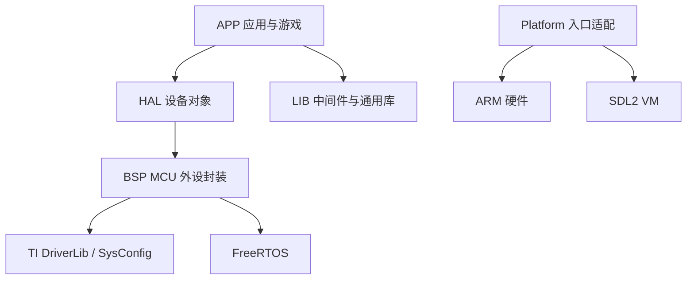

# 项目架构

MSPM0G3507 Framework 的核心目标是把应用逻辑、设备抽象、底层外设和平台差异拆开，使同一套 APP 代码可以运行在真实 MSPM0G3507 硬件和 SDL2 VM 上。

## 总体分层



## 启动流程

`src/main.c` 中的主流程如下：

```text
Platform_Init()
Syscall_Init()
Local_Lib_Init()
Bsp_Init()
Hal_Init()
App_Init()
Hal_Task_Def()
Test_Task_Def()   # 由 TEST_ANY_ENABLE 控制
App_Task_Def()
Platform_Start()
```

其中 `Platform_Start()` 在 ARM 上启动 FreeRTOS 调度器，在 VM 上启动虚拟任务并进入 SDL 事件循环。

## 模块边界

| 层级 | 目录 | 责任 |
| --- | --- | --- |
| APP | `src/app` | 菜单、游戏、存储、资源管理、应用任务 |
| HAL | `src/hal` | Button、Joystick、ST7789、W25Q32、Buzzer、VibMotor(GPIO/PWM) 等对象化封装 |
| BSP | `src/bsp` | GPIO、PWM、ADC、SPI、UART、tick 等 MCU 外设接口 |
| LIB | `lib` | FreeRTOS、LittleFS、LVGL、RTT、本地数据结构和协议工具 |
| PLATFORM | `src/platform` | ARM/VM 初始化、平台启动、可执行目标创建 |
| VM | `src/vm` | SDL2 虚拟显示、输入、音频、振动、FreeRTOS stub |
| TEST | `src/test` | 按开关启用的模块测试任务 |
| CONFIG | `config` | 板级引脚、功能开关、中间件配置、SysConfig 文件 |

## 依赖原则

1. 上层依赖下层，下层不反向依赖上层。
2. APP 不直接操作寄存器或 DriverLib。
3. HAL 不直接关心具体游戏逻辑。
4. BSP 只封装 MCU 外设，不保存业务状态。
5. VM 模拟 HAL/BSP 行为，保证 APP 代码可复用。

## 双平台设计

ARM 与 VM 的差异主要集中在 `src/platform`、`src/bsp`、`src/hal` 和 `src/vm`：

- ARM 目标链接 `ti_device`、真实 BSP/HAL、FreeRTOS portable 层和 SysConfig 生成代码。存储使用 LittleFS + W25Q32 SPI Flash。
- VM 目标链接 `src/vm` 下的虚拟实现，并通过 SDL2 模拟屏幕、输入和反馈。存储使用宿主机文件系统直接读写 `assets/vm_flash/` 目录。
- APP、游戏、存储接口、图形接口不感知当前平台。
