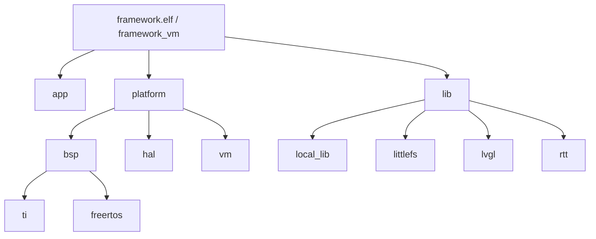

# 构建系统

项目使用 CMake 组织源码，并通过 `scripts/cc.py` 读取 `config/config.yaml` 统一生成构建目标。

## 构建入口

推荐入口：

```bash
python3 scripts/cc.py --target vm
python3 scripts/cc.py --target arm
```

`cc.py` 会完成以下工作：

1. 读取 `config/config.yaml`。
2. 按 `name` 选择构建目标。
3. 创建 `build/<name>/` 构建目录。
4. 将功能开关转换为 CMake `-D` 参数。
5. 执行 CMake configure 和 build。
6. 可选生成 `framework.dot` 依赖图。

## 目标配置

示例：

```yaml
- name: arm
  platform: ARM
  runtime_mode: game
  build_type: MinSizeRel
  generator: ninja
  graphviz: ON
  arm_tool_chain_path: ""
  sysconfig_path: ""
  skip_syscfg: OFF
  FRAMEWORK_USE_FREERTOS: ON
  FRAMEWORK_USE_RTT: OFF
  FRAMEWORK_USE_LVGL: OFF
  FRAMEWORK_USE_LFS: ON
  FRAMEWORK_USE_UART: OFF
```

常见字段：

| 字段 | 说明 |
| --- | --- |
| `name` | 目标名称，例如 `arm`、`vm` |
| `platform` | `ARM` 或 `VM` |
| `runtime_mode` | `game`、`flash_mgr` 或 `test`；缺省为 `game` |
| `build_type` | CMake 构建类型 |
| `generator` | `ninja`、`make` 或 `auto` |
| `graphviz` | 是否生成 CMake 目标关系图 |
| `arm_tool_chain_path` | ARM GCC 根目录；为空时使用 `tools/gcc-arm-none-eabi` |
| `sysconfig_path` | TI SysConfig 根目录；为空时使用 `tools/sysconfig` |
| `skip_syscfg` | 跳过首次编译时自动调用 SysConfig（`ON`/`OFF`） |
| `FRAMEWORK_USE_*` | 功能开关，最终变成编译宏 |

`runtime_mode` 的三个值互斥：`game` 创建游戏机任务，`flash_mgr` 创建 Flash Manager 任务，`test` 按 `config/test_config.h` 中启用的 `TEST_*_ENABLE` 创建测试任务。选择 `flash_mgr` 时必须同时设置 `FRAMEWORK_USE_LFS: ON` 和 `FRAMEWORK_USE_UART: ON`，否则 `cc.py` 会拒绝该配置。

## CMake 静态库结构



主要目标：

| CMake 目标 | 说明 |
| --- | --- |
| `app` | 应用和游戏源码 |
| `bsp` | ARM BSP 外设封装 |
| `hal` | ARM HAL 设备对象 |
| `platform` | 平台接口聚合目标 |
| `platform_arm` | ARM 平台启动实现 |
| `platform_vm` | VM 平台启动实现 |
| `vm` | SDL2 虚拟设备实现 |
| `lib` | 中间件聚合接口库 |
| `freertos` | ARM FreeRTOS 或 VM stub，取决于目标 |
| `test` | 测试任务库 |

## ARM 工具链

`scripts/cc.py` 会读取 ARM target 的 `arm_tool_chain_path`。
当该字段为空字符串时，`cmake/toolchain.cmake` 使用工程内 ARM GCC：

```text
tools/gcc-arm-none-eabi/bin/arm-none-eabi-gcc
tools/gcc-arm-none-eabi/bin/arm-none-eabi-g++
tools/gcc-arm-none-eabi/bin/arm-none-eabi-objcopy
tools/gcc-arm-none-eabi/bin/arm-none-eabi-size
```

当该字段非空时，`cc.py` 会把解析后的路径作为 `-DARM_TOOLCHAIN_ROOT=<path>`
传给 CMake；相对路径按仓库根目录解析，绝对路径保持不变。这个工具链只用于 ARM 目标，
VM 目标使用主机编译器。

ARM 编译参数包括：

```text
-mcpu=cortex-m0plus
-march=armv6-m
-mthumb
-mfloat-abi=soft
-ffunction-sections
-fdata-sections
-mno-unaligned-access
```

链接阶段使用：

```text
-Wl,--gc-sections
-Wl,-Map,framework.map
--specs=nano.specs
--specs=nosys.specs
```

## SysConfig 集成

ARM 目标会调用 `cmake/tools.cmake` 中的 `syscfg_gen()`：

- 输入：`config/framework.syscfg`
- 工具：`sysconfig_path` 指定目录下的 `sysconfig_cli.sh`，为空时使用 `tools/sysconfig/sysconfig_cli.sh`
- 输出：`config/syscfg/ti_msp_dl_config.c`、`.h`、`device.opt`

`cc.py` 会把解析后的 SysConfig 路径作为 `-DSYSCONFIG_ROOT=<path>` 传给 CMake，
同时传递 `-DSKIP_SYSCFG=ON|OFF`。设置 `skip_syscfg: ON` 可跳过 SysConfig 自动生成，
适用于已有生成文件或不需要重新生成的场景。
SysConfig 主要在重新生成 `config/syscfg/` 时需要；已有生成文件参与 BSP 编译。

BSP 会把 SysConfig 生成的 C 文件加入编译。

## 输出文件

ARM 目标构建后：

```text
build/arm/framework.elf
build/arm/framework.hex
build/arm/framework.bin
build/arm/framework.map
build/arm/framework.dot
```

VM 目标构建后：

```text
build/vm/framework_vm
```

## 清理构建

可以直接删除构建目录：

```bash
rm -rf build/arm build/vm
```

或使用项目中的清理脚本：

```bash
bash scripts/clear.bash
```
