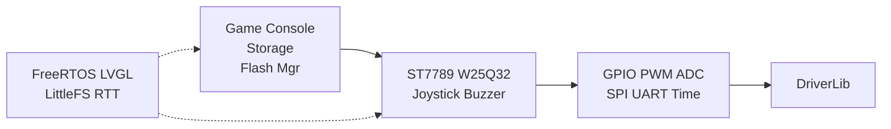

# 00 — Introduction

MSPM0G3507 Framework provides a complete embedded software stack for TI MSPM0G3507: from register-level drivers to game console applications. Dual-platform build (ARM + x86 SDL2 VM), with APP layer code designed to be fully reusable.

## Key Design Decisions

- **APP → HAL → BSP → DriverLib** one-way dependency, reverse forbidden
- **Compile-time composition**: select modules via `config.yaml`, disabled modules have negligible resource cost
- **VM parity**: the same APP code runs on ARM and x86
- **Object-style HAL**: `Create(config)` → `Init()` → `Update()`

## Platform Support

| Platform | Compiler | Use |
| --- | --- | --- |
| MSPM0G3507 | arm-none-eabi-gcc | Production firmware |
| x86_64 | GCC/Clang + SDL2 | Development & debugging |

## Core Components

## Document Map

| If you want to... | Read |
| --- | --- |
| Understand the architecture | [01_architecture.md](01_architecture.md) |
| Build the project | [02_build_system.md](02_build_system.md) |
| Find a specific API | [03_bsp_hal_app.md](03_bsp_hal_app.md) |
| Understand FreeRTOS/LVGL/LFS/RTT | [04_middleware.md](04_middleware.md) |
| Understand storage | [05_storage.md](05_storage.md) |
| Understand the game console | [06_game_console.md](06_game_console.md) |
| Use the VM simulator | [07_vm_simulator.md](07_vm_simulator.md) |
| Change configuration | [08_configuration.md](08_configuration.md) |
| Port to another MCU | [09_porting.md](09_porting.md) |
| Add a new module/game/test | [10_developer_guide.md](10_developer_guide.md) |
| Understand design rationale | [11_design_principles.md](11_design_principles.md) |
| See ADRs | [adr/architecture_decisions.md](adr/architecture_decisions.md) |
