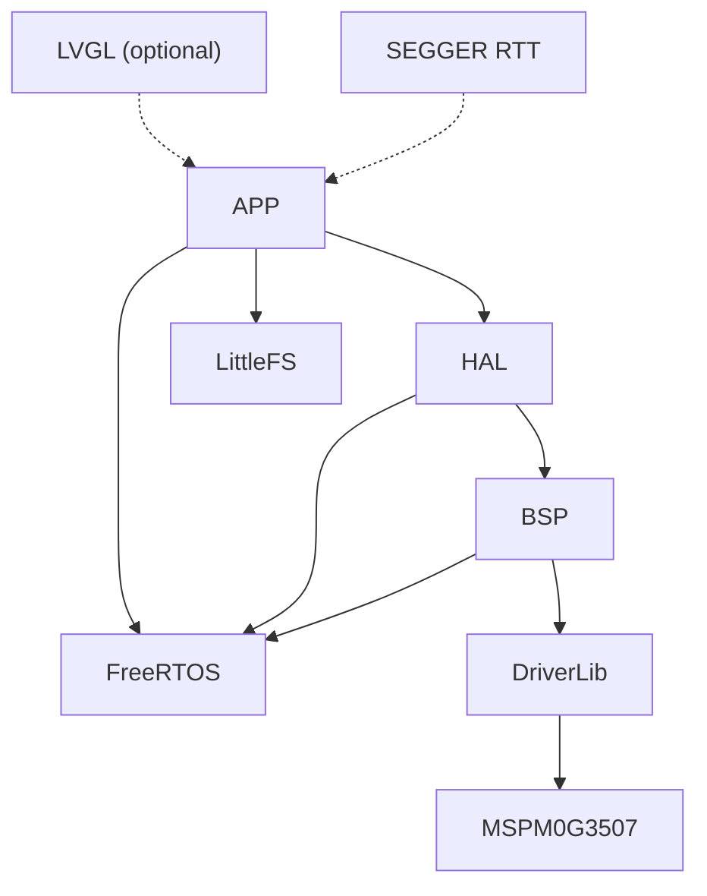
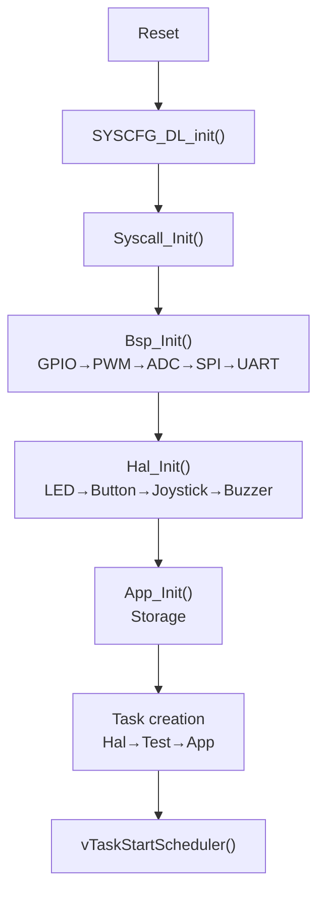

# 01 — Architecture

## Layered Architecture

```
APP  — application logic (Game Console, Storage, Flash Manager)
HAL  — hardware objects (ST7789, W25Q32, Joystick, Buzzer)
BSP  — peripheral wrappers (GPIO, PWM, ADC, SPI, UART, Time)
DriverLib — TI register-level API
```



## Startup Flow



## Task Topology

| Task | Prio | Stack | Period | Owns |
| --- | --- | --- | --- | --- |
| Tmr Svc | 4 | 128w | tick | Software timers |
| FlashMgr | 2 | 1024w | event | CMD queue |
| Gpio_Task | 1 | 128w | 10ms | LED, Button |
| Buzzer_Task | 1 | 128w | 5ms | Note sequencer |
| Game | 1 | 1024w | 20ms | Console loop |

## Dependency Rules

### Forbidden

```
APP ──✕──► DriverLib    (VM parity)
HAL ──✕──► DriverLib    (BSP sole consumer)
BSP ──✕──► APP/HAL      (layer inversion)
```

### Allowed

```
APP  ──► HAL, FreeRTOS, LittleFS
HAL  ──► BSP, FreeRTOS
BSP  ──► DriverLib, FreeRTOS
```

### Known Exception

`APP → Bsp_Get_Tick_Ms()` is tolerated. Time is a system property, not a peripheral. See ADR for rationale.

## Directory Structure

```
src/
├── app/          APP — business logic
│   ├── game_console/  menu, games, scores, screensaver
│   ├── storage/       raw Flash + LittleFS API
│   ├── flash_mgr/     UART remote management
│   ├── lfs_port/      LittleFS block device
│   └── games/         per-game implementations
├── hal/          HAL — hardware objects
│   ├── st7789/  w25q32/  joystick/  button/
│   ├── buzzer/  led_simple/  led_breath/  com_uart/
├── bsp/          BSP — peripheral wrappers
│   ├── gpio/  pwm/  adc/  spi/  uart/  time/
├── vm/           SDL2 VM
│   ├── bsp/  hal/  freertos/  main_vm.c
├── test/         test modules
└── syscall/      newlib retarget + RTT
lib/              middleware (FreeRTOS, LVGL, LittleFS, RTT, local_lib)
config/           all configuration files
```

## Code Style

Based on Google style, 4-space indent, 110-col limit. Key naming:

| Element | Convention | Example |
| --- | --- | --- |
| Public function | `Module_Verb()` | `Joystick_Create()` |
| BSP function | `Bsp_Periph_Action()` | `Bsp_Gpio_Write()` |
| Static function | `snake_case()` | `read_direction()` |
| Config struct | `PascalCase_config` | `St7789_config` |
| Macro | `UPPER_SNAKE_CASE` | `FRAMEWORK_USE_FREERTOS` |

`.clang-format` enforces rules automatically. Header guard: `#pragma once`. Return convention: `uint8_t` (0=fail, 1=ok), pointer (NULL=fail).

## Technical Debt

| Debt | Impact | Fix |
| --- | --- | --- |
| `board_config.h` global recompile | Minor | Split per-peripheral |
| Game icons in `game_console.c` | Contributors must edit console core | Move draw fn to `Game_descriptor` |
| `APP → Bsp_Get_Tick_Ms()` | All APP depends on `bsp_time.h` | Add `Sys_Get_Tick_Ms()` |
| Init ordering manual | Fragile cross-module deps | Add `configASSERT` guards |
| `g_games[]` static order | No runtime sorting | Add `category` + `sort_key` |
