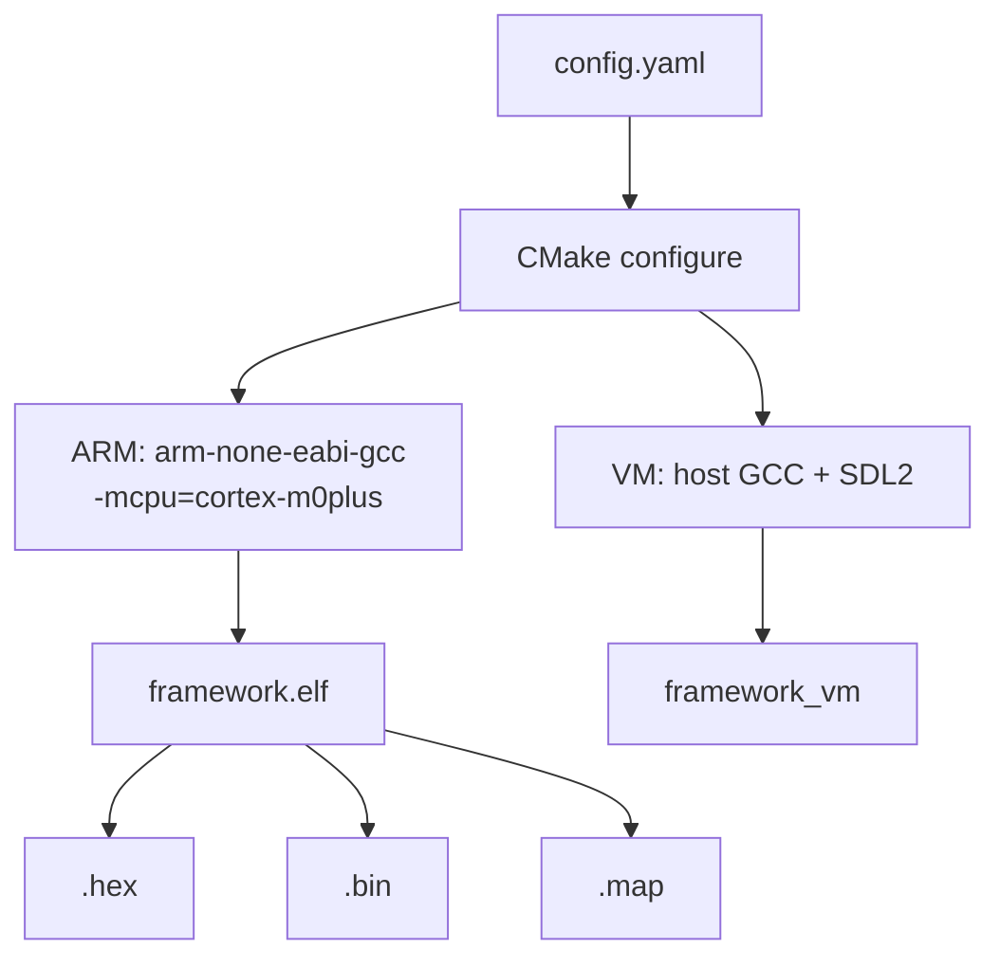

# 02 — Build System

CMake + Ninja, dual-platform build.

## Build Flow



## Workflow

Two-step build: first configure `platform` and feature flags for each target (`name:` unique identifier) in `config/config.yaml`, then drive the build via `cc.py`. `cc.py` reads YAML and passes all switches as `-D` to CMake — **running cmake directly skips configuration; module switches won't take effect**.

```bash
# 1. Edit config/config.yaml (configure platform and module switches for each name)
# 2. Build
python3 scripts/cc.py                  # Build all targets (build: list)
python3 scripts/cc.py --target arm     # Build only the target with name=arm (--target matches name, not platform)
python3 scripts/cc.py --target vm      # Build only the target with name=vm

# Or use the bash shortcut
bash scripts/cm.bash --target vm
```

Output goes to `build/<name>/` (matching the `name:` field in config, e.g. `build/arm/framework.elf`, `build/vm/framework_vm`).

## Compiler Flags (ARM)

```
-mcpu=cortex-m0plus -march=armv6-m -mthumb -mfloat-abi=soft
-Wall -ffunction-sections -fdata-sections -mno-unaligned-access
-Wl,--gc-sections --specs=nano.specs --specs=nosys.specs
```

## Feature Switches

Defined in `config.yaml`, propagated as `#define` to all sources:

| Macro | Default | Effect |
| --- | --- | --- |
| `FRAMEWORK_USE_FREERTOS` | ON | FreeRTOS kernel |
| `FRAMEWORK_USE_LVGL` | OFF | LVGL library |
| `FRAMEWORK_USE_LFS` | ON | LittleFS |
| `FRAMEWORK_USE_RTT` | OFF | SEGGER RTT |
| `FRAMEWORK_USE_UART` | OFF | UART subsystem |

When a macro is `0`, the corresponding code is compiled as empty stubs or fully excluded via `#if` guards.

## VM Build

```cmake
add_library(hal INTERFACE)     # src/vm/hal replaces src/hal
add_library(bsp INTERFACE)     # src/vm/bsp replaces src/bsp
add_library(ti INTERFACE)      # DriverLib stubbed out
find_package(SDL2 REQUIRED)
target_link_libraries(framework_vm PRIVATE vm app lib ${SDL2_LIBRARIES})
```

APP layer source code is unchanged. HAL/BSP/DriverLib are replaced by VM implementations. FreeRTOS APIs are mapped to POSIX threads.

## Output Files

| File | Content |
| --- | --- |
| `framework.elf` | ELF with debug symbols |
| `framework.hex` | Intel HEX |
| `framework.bin` | Raw binary |
| `framework.map` | Linker map |
| `compile_commands.json` | clangd compilation database |

## SysConfig Integration

`cmake/tools.cmake` calls TI SysConfig CLI during CMake configure to generate `ti_msp_dl_config.c/h` (`SYSCFG_DL_init()`). VM build skips this step.
