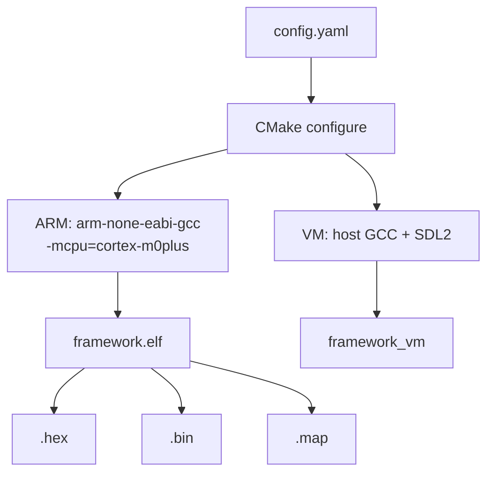

# 02 — Build System

CMake + Ninja，双平台构建。

## Build Flow



## Workflow

构建分两步：先在 `config/config.yaml` 中为每个 target（`name:` 唯一标识）配置 `platform` 和 feature flags，然后通过 `cc.py` 驱动构建。`cc.py` 读取 YAML 并将所有开关作为 `-D` 传递给 CMake——**直接运行 cmake 会跳过配置，模块开关不生效**。

```bash
# 1. 编辑 config/config.yaml（为每个 name 配置 platform 和模块开关）
# 2. 构建
python3 scripts/cc.py                  # 构建所有 target（build: 列表）
python3 scripts/cc.py --target arm     # 仅构建 name=arm 的 target（--target 匹配 name，非 platform）
python3 scripts/cc.py --target vm      # 仅构建 name=vm 的 target

# 或使用 bash 快捷方式
bash scripts/cm.bash --target vm
```

产物输出到 `build/<name>/`（与 config 中 `name:` 对应，如 `build/arm/framework.elf`、`build/vm/framework_vm`）。

## Compiler Flags (ARM)

```
-mcpu=cortex-m0plus -march=armv6-m -mthumb -mfloat-abi=soft
-Wall -ffunction-sections -fdata-sections -mno-unaligned-access
-Wl,--gc-sections --specs=nano.specs --specs=nosys.specs
```

## Feature Switches

Defined in `config.yaml`, propagated as `#define` to all sources:

| Macro | Default | Effect |
| --- | --- | --- |
| `FRAMEWORK_USE_FREERTOS` | ON | FreeRTOS kernel |
| `FRAMEWORK_USE_LVGL` | OFF | LVGL library |
| `FRAMEWORK_USE_LFS` | ON | LittleFS |
| `FRAMEWORK_USE_RTT` | OFF | SEGGER RTT |
| `FRAMEWORK_USE_UART` | OFF | UART subsystem |

When a macro is `0`, the corresponding code is compiled as empty stubs or fully excluded via `#if` guards.

## VM Build

```cmake
add_library(hal INTERFACE)     # src/vm/hal replaces src/hal
add_library(bsp INTERFACE)     # src/vm/bsp replaces src/bsp
add_library(ti INTERFACE)      # DriverLib stubbed out
find_package(SDL2 REQUIRED)
target_link_libraries(framework_vm PRIVATE vm app lib ${SDL2_LIBRARIES})
```

APP 层源码不变。HAL/BSP/DriverLib 被 VM 实现替换。FreeRTOS API 映射到 POSIX 线程。

## Output Files

| File | Content |
| --- | --- |
| `framework.elf` | ELF with debug symbols |
| `framework.hex` | Intel HEX |
| `framework.bin` | Raw binary |
| `framework.map` | Linker map |
| `compile_commands.json` | clangd compilation database |

## SysConfig Integration

`cmake/tools.cmake` 在 CMake configure 时调用 TI SysConfig CLI 生成 `ti_msp_dl_config.c/h`（`SYSCFG_DL_init()`）。VM 构建跳过此步骤。
