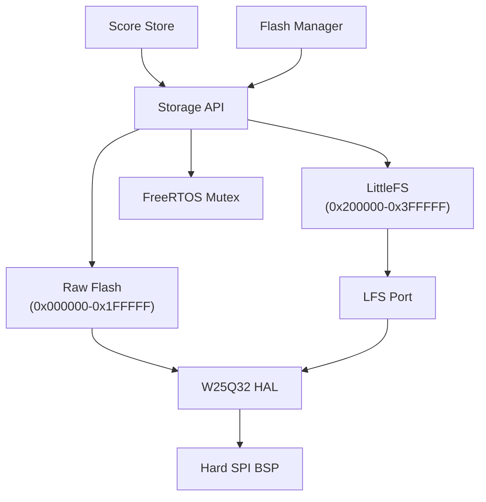
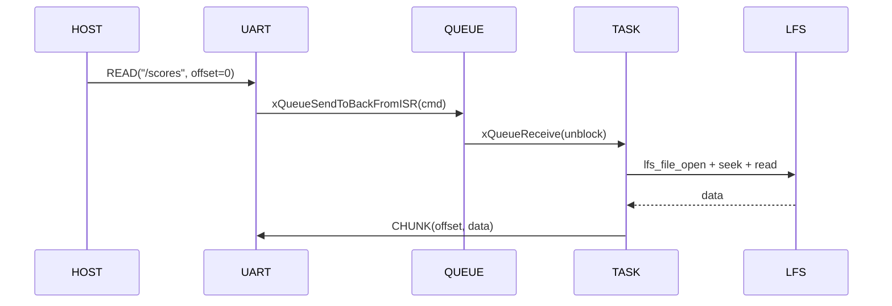

# 05 — Storage

## Flash Layout

```
W25Q32 4 MiB
├── 0x000000–0x1FFFFF (2 MiB): Raw Flash
│   └── Air Battle BG cache, reserved assets
└── 0x200000–0x3FFFFF (2 MiB): LittleFS
    └── scores, save data
```

## Public API

```c
// Lifecycle
uint8_t Storage_Init(void);         // Mount LittleFS, init W25Q32
uint8_t Storage_Is_Available(void);

// Raw Flash (low 2 MiB, address < 0x200000)
uint8_t Storage_Raw_Read(uint32_t addr, void* data, uint32_t size);
uint8_t Storage_Raw_Write(uint32_t addr, const void* data, uint32_t size);
uint8_t Storage_Raw_Erase(uint32_t addr, uint32_t size);  // sector-aligned

// Filesystem (high 2 MiB)
lfs_t* Storage_Get_Lfs(void);
uint8_t Storage_Format(void);       // Format + re-mount

// Thread safety (FreeRTOS mutex)
void Storage_Lock(void);
void Storage_Unlock(void);
```

## Architecture



## Flash Manager

UART 二进制协议远程管理 LittleFS 文件。

### Frame Format

```
SYNC0(0xAA) SYNC1(0x55) CMD(1B) SEQ(2B BE) LEN(2B BE) DATA(0-517B) CRC(2B)
```

### Commands

| Cmd | Code | Payload | Response |
| --- | --- | --- | --- |
| READ | 0x01 | path + offset(4) | CHUNK / EOF / NAK |
| WRITE | 0x02 | path + offset(4) + data | ACK / NAK |
| DELETE | 0x03 | path | ACK / NAK |
| LIST | 0x04 | path | LIST_ITEM* + LIST_END |
| INFO | 0x05 | path | INFO_RESP / NAK |
| FORMAT | 0x06 | — | ACK / NAK |
| RESET | 0x07 | — | ACK |

### Error Codes

`NOENT(0x01) NOSPC(0x02) INVAL(0x03) EXIST(0x04) IO(0x05) CORRUPT(0x06)` — mapped from `LFS_ERR_*`.

### Task

Priority 2, queue-driven (depth 4). COM UART RX ISR → queue → task handler → `handle_read/write/delete/list/info/format`.

### Flow



Gated by `FLASH_MGR_ENABLE` in `app_config.h` and `FRAMEWORK_USE_LFS` in `config.yaml`.
