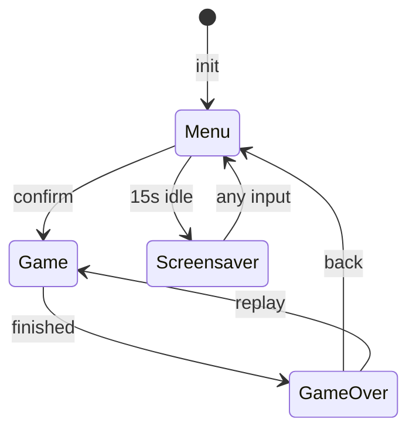

# 06 — Game Console

## Architecture

Game descriptor pattern, 3-state state machine.



## Game Descriptor

```c
typedef struct {
    const char* name;          // Display name (max 8 chars)
    Game_icon icon;            // Menu icon enum
    Game_id id;                // Unique identifier
    void (*init)(const Game_hardware* hw);
    Game_result (*update)(const Game_input* input);
    uint32_t (*get_score)(void);
    uint8_t (*is_finished)(void);
} Game_descriptor;
```

`Game_hardware` = `{ St7789* lcd; Buzzer* buzzer; }`.
`Game_input` = `{ direction, direction_pressed, confirm_pressed, back_requested }`.

Adding a game: implement 4 functions → add enum entries → register descriptor → draw icon. See [10_developer_guide.md](10_developer_guide.md).

## Input System

Joystick (ADC X/Y) → normalized [-1.0, 1.0] → `game_direction_{up,left,down,right,none}`.

Button (GPIO):
- Short press (<1s) → confirm
- Long press (≥1s) → back

Direction change only fires once (`direction_pressed = new_direction != last_direction`), preventing repeat while holding.

## Menu

3×2 grid per page, pagination with wrap. Each cell: icon (procedural) + name + high score. Navigation with arrow key + page flip on edge.

## Game Over Flow

Prompt ("Enter Name" / "Skip") → Keyboard (6×6 chars + DEL/SAVE) → Leaderboard (Top 10, replay/menu).

Score persistence via `Score_Store` → LittleFS `"scores"` file.

## Screensaver

15 seconds idle in menu → colored pipes creep orthogonally (xorshift PRNG, 18% turn chance, max 250 steps, seamless respawn).

## Audio

35 pre-defined SFX in `buzzer_sfx_library[]`. Menu events + 16 game-specific categories. `Buzzer_Play_Sfx(obj, sfx_idx)`.

## Rendering

Direct framebuffer via `Game_Graphics` primitives — no LVGL widget overhead. `Fill_Rect`, `Draw_Text`, `Draw_U32`, `Draw_Bitmap`, `Draw_Gray4_Bitmap`, `Draw_Pal4_Bitmap`.

## Task

Priority 1, 1024 words stack, 20ms period (50 FPS target).

## Key Files

| File | Role |
| --- | --- |
| `game_console.c` | Input poll, state dispatch, init |
| `game_registry.c` | Static game descriptor table |
| `game_graphics.c` | Rendering primitives |
| `game_over_menu.c` | 3-stage post-game flow |
| `score_store.c` | LittleFS score persistence |
| `screensaver.c` | Pipe-trail screensaver |
