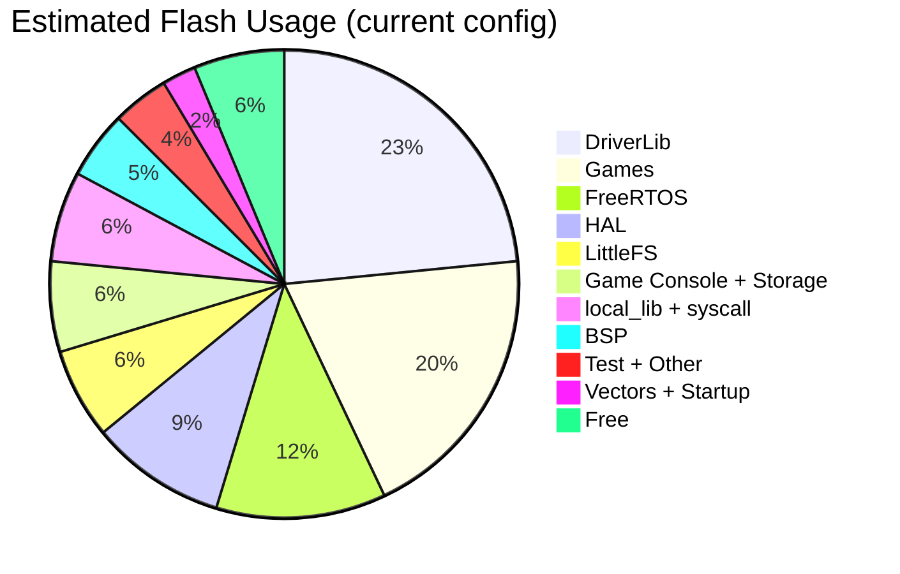

# 12 — Memory Layout

## Linker Script

`ti_device/.../mspm0g3507.lds`:

| Region | Origin | Size |
| --- | --- | --- |
| FLASH | 0x00000000 | 128 KB |
| SRAM | 0x20200000 | 32 KB |
| Min Heap (newlib) | — | 1 KB |
| Min Stack | — | 128 B |

## Flash (128 KB)

The following is an estimate based on the current build configuration; verify actual sizes via `arm-none-eabi-size` and the map file.



## RAM (32 KB)

| Region | Size | Content |
| --- | --- | --- |
| .data + .bss | ~3 KB | Global/static variables |
| newlib heap | 1 KB | `_sbrk` region |
| FreeRTOS heap (heap_4) | 14 KB | Tasks, HAL objects, queues, semaphores |
| LFS buffers (static) | 528 B | read 256B + prog 256B + lookahead 16B |
| System stack | 128 B | ISR + startup |

### FreeRTOS Heap Breakdown

| Allocation | Size |
| --- | --- |
| Game task stack | 4 KB (1024 words) |
| Flash Manager task stack | 4 KB (1024 words) |
| Gpio_Task stack | 512 B (128 words) |
| Buzzer_Task stack | 512 B (128 words) |
| Timer task stack | 512 B (128 words) |
| HAL objects (ST7789, W25Q32, etc.) | ~500 B |
| Queues + Semaphores | ~2 KB |
| Free/margin | ~2 KB |

## Task Stacks

High water marks below are measured on a specific build under typical load; actual values vary with compiler version, optimization level, and workload. Verify with `uxTaskGetStackHighWaterMark(NULL)`.

| Task | Stack | High Water (measured) | Margin |
| --- | --- | --- | --- |
| Game_Console | 4096 B | ~3072 B | 25% |
| Flash_Mgr | 4096 B | ~3584 B | 12% |
| Gpio_Task | 512 B | ~320 B | 37% |
| Buzzer_Task | 512 B | ~256 B | 50% |

Verified with `uxTaskGetStackHighWaterMark(NULL)`. `configCHECK_FOR_STACK_OVERFLOW=2`.

## W25Q32 External Flash (4 MiB)

```
0x000000 – 0x1FFFFF (2 MiB): Raw Flash (game assets, BG cache)
0x200000 – 0x3FFFFF (2 MiB): LittleFS (scores, save data)
```

## When LVGL Enabled

Additional ~45 KB Flash + ~15-30 KB RAM (display buffers). Currently disabled; game console uses direct rendering.

## Size-Optimization Techniques

- `-ffunction-sections -fdata-sections` + `-Wl,--gc-sections`: dead code elimination
- `--specs=nano.specs`: newlib-nano
- Static LFS buffers: no heap fragmentation
- Compile-time config: unused modules are designed to produce no extra code (verify via map file)
- Direct framebuffer rendering: no LVGL widget/RAM overhead
