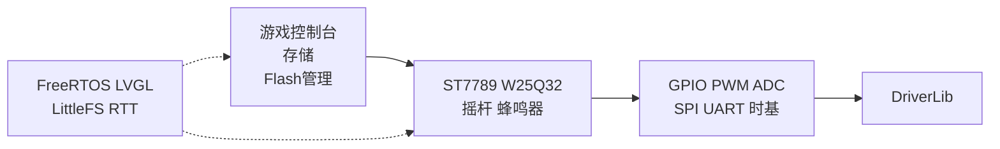

# 00 — 项目介绍

MSPM0G3507 Framework 为 TI MSPM0G3507 提供完整嵌入式软件栈：从寄存器级驱动到游戏控制台应用。双平台构建（ARM + x86 SDL2 VM），应用层代码完全复用。

## 核心设计决策

- **APP → HAL → BSP → DriverLib** 单向依赖，禁止反向
- **编译期组合**：通过 `config.yaml` 选择模块，禁用模块零资源消耗
- **VM 对等**：同一份 APP 代码在 ARM 和 x86 上运行
- **对象式 HAL**：`Create(config)` → `Init()` → `Update()`

## 平台支持

| 平台 | 编译器 | 用途 |
| --- | --- | --- |
| MSPM0G3507 | arm-none-eabi-gcc | 生产固件 |
| x86_64 | GCC/Clang + SDL2 | 开发调试 |

## 核心组件

## 文档导航

| 如果你想... | 阅读 |
| --- | --- |
| 理解架构 | [01_architecture.md](01_architecture.md) |
| 构建项目 | [02_build_system.md](02_build_system.md) |
| 查找 API | [03_bsp_hal_app.md](03_bsp_hal_app.md) |
| 了解中间件 | [04_middleware.md](04_middleware.md) |
| 了解存储 | [05_storage.md](05_storage.md) |
| 了解游戏控制台 | [06_game_console.md](06_game_console.md) |
| 使用 VM 仿真器 | [07_vm_simulator.md](07_vm_simulator.md) |
| 修改配置 | [08_configuration.md](08_configuration.md) |
| 移植到其他 MCU | [09_porting.md](09_porting.md) |
| 新增模块/游戏/测试 | [10_developer_guide.md](10_developer_guide.md) |
| 理解设计理由 | [11_design_principles.md](11_design_principles.md) |
| 查看架构决策 | [../en/adr/architecture_decisions.md](../en/adr/architecture_decisions.md) |
