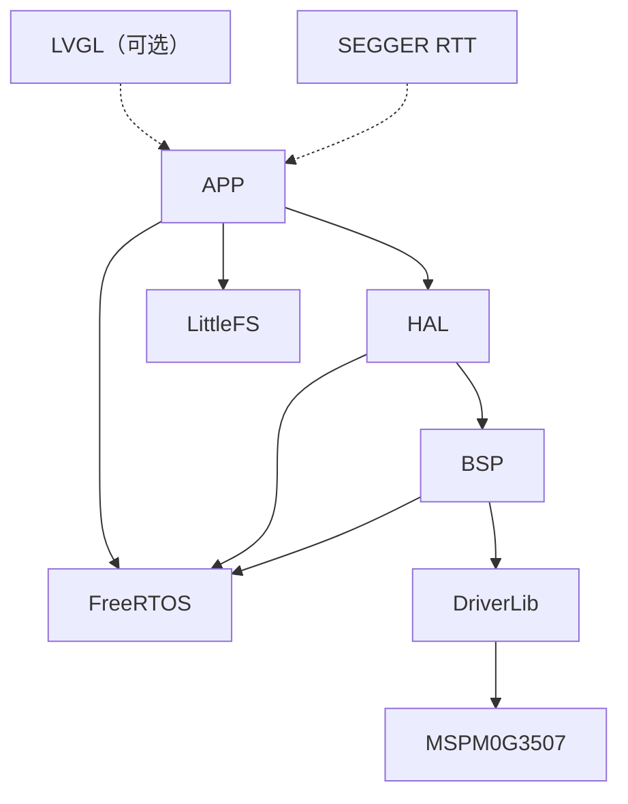
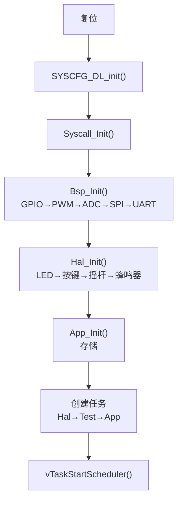

# 01 — 架构

## 分层架构

```
APP  — 应用逻辑（游戏控制台、存储、Flash 管理）
HAL  — 硬件对象（ST7789、W25Q32、摇杆、蜂鸣器）
BSP  — 外设封装（GPIO、PWM、ADC、SPI、UART、时基）
DriverLib — TI 寄存器级 API
```



## 启动流程



## 任务拓扑

| 任务 | 优先级 | 栈 | 周期 | 职责 |
| --- | --- | --- | --- | --- |
| Tmr Svc | 4 | 128字 | tick | 软件定时器 |
| FlashMgr | 2 | 1024字 | 事件驱动 | 命令队列 |
| Gpio_Task | 1 | 128字 | 10ms | LED、按键 |
| Buzzer_Task | 1 | 128字 | 5ms | 音符序列 |
| Game | 1 | 1024字 | 20ms | 控制台主循环 |

## 依赖规则

### 禁止

```
APP ──✕──► DriverLib    （VM 对等）
HAL ──✕──► DriverLib    （BSP 为唯一消费者）
BSP ──✕──► APP/HAL      （层次反转）
```

### 允许

```
APP  ──► HAL、FreeRTOS、LittleFS
HAL  ──► BSP、FreeRTOS
BSP  ──► DriverLib、FreeRTOS
```

### 已知例外

`APP → Bsp_Get_Tick_Ms()` 被容忍。时间是系统属性而非外设。详见 ADR。

## 目录结构

```
src/
├── app/          应用层
│   ├── game_console/  菜单、游戏、高分、屏保
│   ├── storage/       裸 Flash + LittleFS API
│   ├── flash_mgr/     UART 远程管理
│   ├── lfs_port/      LittleFS 块设备
│   └── games/         各游戏实现
├── hal/          硬件抽象层
│   ├── st7789/  w25q32/  joystick/  button/
│   ├── buzzer/  led_simple/  led_breath/  com_uart/
├── bsp/          板级支持包
│   ├── gpio/  pwm/  adc/  spi/  uart/  time/
├── vm/           SDL2 虚拟机
│   ├── bsp/  hal/  freertos/  main_vm.c
├── test/         测试模块
└── syscall/      newlib 重定向 + RTT
lib/              中间件（FreeRTOS、LVGL、LittleFS、RTT、local_lib）
config/           所有配置文件
```

## 代码风格

基于 Google 风格，4 空格缩进，110 列限制。关键命名：

| 元素 | 约定 | 示例 |
| --- | --- | --- |
| 公开函数 | `模块_动词()` | `Joystick_Create()` |
| BSP 函数 | `Bsp_外设_动作()` | `Bsp_Gpio_Write()` |
| 静态函数 | `snake_case()` | `read_direction()` |
| 配置结构体 | `PascalCase_config` | `St7789_config` |
| 宏 | `UPPER_SNAKE_CASE` | `FRAMEWORK_USE_FREERTOS` |

`.clang-format` 自动执行规则。头文件保护：`#pragma once`。返回值约定：`uint8_t`（0=失败，1=成功），指针（NULL=失败）。

## 技术债务

| 债务 | 影响 | 修复方案 |
| --- | --- | --- |
| `board_config.h` 全局重编译 | 轻微 | 拆分为按外设分离的头文件 |
| 游戏图标在 `game_console.c` 中 | 贡献者必须编辑控制台核心 | 将绘制函数移入 `Game_descriptor` |
| `APP → Bsp_Get_Tick_Ms()` | 所有 APP 依赖 `bsp_time.h` | 添加 `Sys_Get_Tick_Ms()` |
| 初始化顺序手动维护 | 跨模块依赖脆弱 | 添加 `configASSERT` 守卫 |
| `g_games[]` 静态顺序 | 无运行时排序 | 添加 `category` + `sort_key` |
