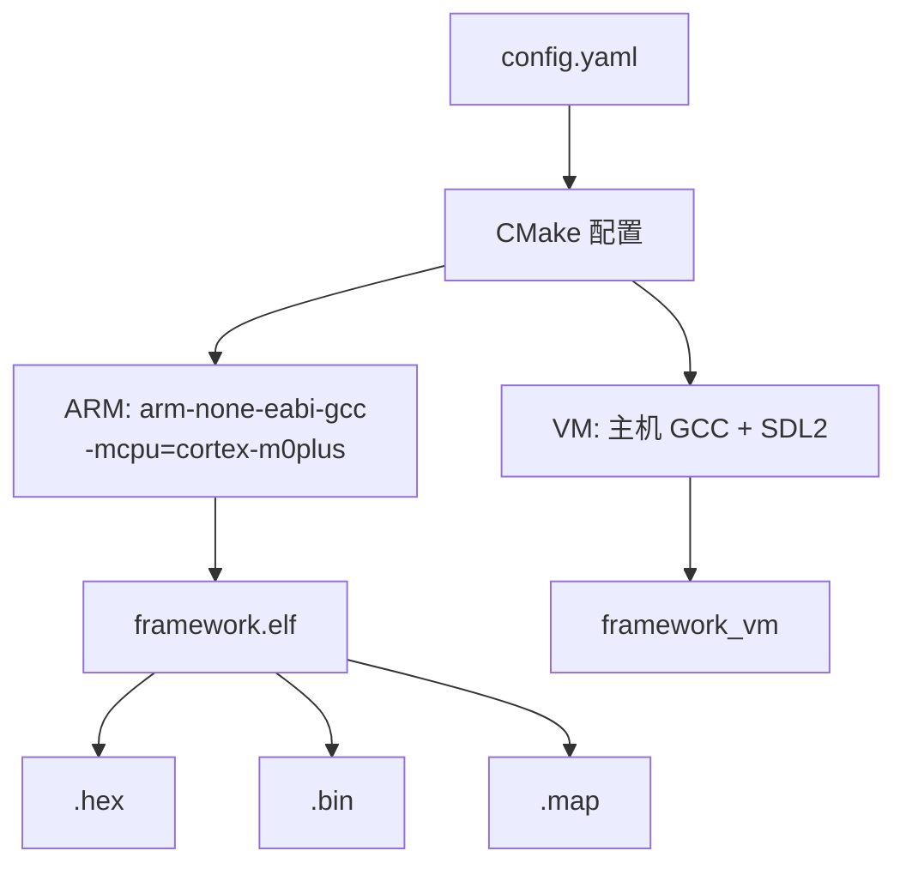

# 02 — 构建系统

CMake + Ninja，双平台构建。

## 构建流程



## 工作流

构建分两步：先在 `config/config.yaml` 中为每个 target（`name:` 唯一标识）配置 `platform` 和 feature flags，然后通过 `cc.py` 驱动构建。`cc.py` 读取 YAML 并将所有开关作为 `-D` 传递给 CMake——**直接运行 cmake 会跳过配置，模块开关不生效**。

```bash
# 1. 编辑 config/config.yaml（为每个 name 配置 platform 和模块开关）
# 2. 构建
python3 scripts/cc.py                  # 构建所有 target（build: 列表）
python3 scripts/cc.py --target arm     # 仅构建 name=arm 的 target（--target 匹配 name，非 platform）
python3 scripts/cc.py --target vm      # 仅构建 name=vm 的 target

# 或使用 bash 快捷方式
bash scripts/cm.bash --target vm
```

产物输出到 `build/<name>/`（与 config 中 `name:` 对应，如 `build/arm/framework.elf`、`build/vm/framework_vm`）。

## 编译选项（ARM）

```
-mcpu=cortex-m0plus -march=armv6-m -mthumb -mfloat-abi=soft
-Wall -ffunction-sections -fdata-sections -mno-unaligned-access
-Wl,--gc-sections --specs=nano.specs --specs=nosys.specs
```

## 特性开关

定义在 `config.yaml`，以 `#define` 传递给所有源文件：

| 宏 | 默认值 | 作用 |
| --- | --- | --- |
| `FRAMEWORK_USE_FREERTOS` | ON | FreeRTOS 内核 |
| `FRAMEWORK_USE_LVGL` | OFF | LVGL 图形库 |
| `FRAMEWORK_USE_LFS` | ON | LittleFS 文件系统 |
| `FRAMEWORK_USE_RTT` | OFF | SEGGER RTT 日志 |
| `FRAMEWORK_USE_UART` | OFF | UART 子系统 |

当宏为 `0` 时，对应代码编译为空桩或由 `#if` 排除。

## VM 构建

```cmake
add_library(hal INTERFACE)     # src/vm/hal 替换 src/hal
add_library(bsp INTERFACE)     # src/vm/bsp 替换 src/bsp
add_library(ti INTERFACE)      # DriverLib 桩
find_package(SDL2 REQUIRED)
target_link_libraries(framework_vm PRIVATE vm app lib ${SDL2_LIBRARIES})
```

APP 层源码不变。HAL/BSP/DriverLib 被 VM 实现替换。FreeRTOS API 映射到 POSIX 线程。

## 构建输出

| 文件 | 内容 |
| --- | --- |
| `framework.elf` | 含调试符号的 ELF |
| `framework.hex` | Intel HEX |
| `framework.bin` | 原始二进制 |
| `framework.map` | 链接映射 |
| `compile_commands.json` | clangd 编译数据库 |

## SysConfig 集成

`cmake/tools.cmake` 在 CMake 配置时调用 TI SysConfig CLI 生成 `ti_msp_dl_config.c/h`（包含 `SYSCFG_DL_init()`）。VM 构建跳过此步骤。
