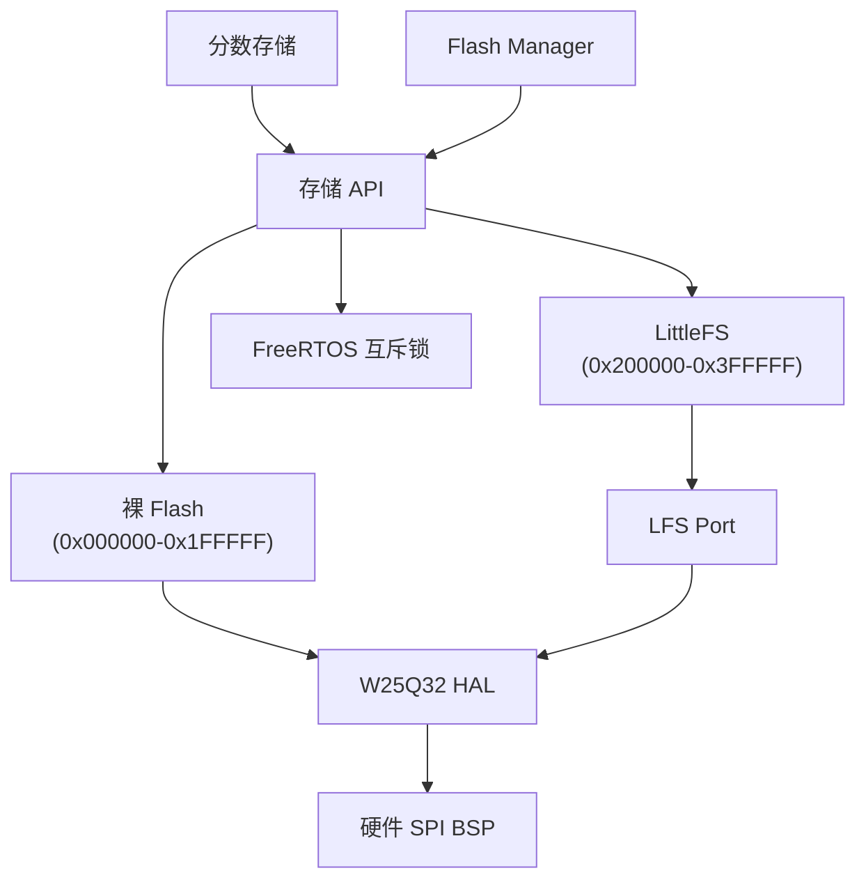
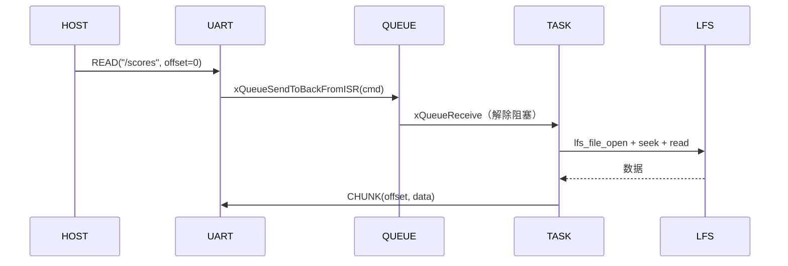

# 05 — 存储

## Flash 布局

```
W25Q32 4 MiB
├── 0x000000–0x1FFFFF（2 MiB）：裸 Flash
│   └── 飞机大战背景缓存、保留素材
└── 0x200000–0x3FFFFF（2 MiB）：LittleFS
    └── 分数、存档数据
```

## 公开 API

```c
// 生命周期
uint8_t Storage_Init(void);         // 挂载 LittleFS，初始化 W25Q32
uint8_t Storage_Is_Available(void);

// 裸 Flash（低 2 MiB，地址 < 0x200000）
uint8_t Storage_Raw_Read(uint32_t addr, void* data, uint32_t size);
uint8_t Storage_Raw_Write(uint32_t addr, const void* data, uint32_t size);
uint8_t Storage_Raw_Erase(uint32_t addr, uint32_t size);  // 扇区对齐

// 文件系统（高 2 MiB）
lfs_t* Storage_Get_Lfs(void);
uint8_t Storage_Format(void);       // 格式化 + 重新挂载

// 线程安全（FreeRTOS 互斥锁）
void Storage_Lock(void);
void Storage_Unlock(void);
```

## 架构



## Flash Manager

UART 二进制协议远程管理 LittleFS 文件。

### 帧格式

```
SYNC0(0xAA) SYNC1(0x55) CMD(1B) SEQ(2B 大端) LEN(2B 大端) DATA(0-517B) CRC(2B)
```

### 命令

| 命令 | 码 | 载荷 | 响应 |
| --- | --- | --- | --- |
| READ | 0x01 | 路径 + 偏移(4) | CHUNK / EOF / NAK |
| WRITE | 0x02 | 路径 + 偏移(4) + 数据 | ACK / NAK |
| DELETE | 0x03 | 路径 | ACK / NAK |
| LIST | 0x04 | 路径 | LIST_ITEM* + LIST_END |
| INFO | 0x05 | 路径 | INFO_RESP / NAK |
| FORMAT | 0x06 | — | ACK / NAK |
| RESET | 0x07 | — | ACK |

### 错误码

`NOENT(0x01) NOSPC(0x02) INVAL(0x03) EXIST(0x04) IO(0x05) CORRUPT(0x06)` — 映射自 `LFS_ERR_*`。

### 任务

优先级 2，队列驱动（深度 4）。COM UART RX ISR → 队列 → 任务处理器 → `handle_read/write/delete/list/info/format`。

### 流程



由 `app_config.h` 中的 `FLASH_MGR_ENABLE` 和 `config.yaml` 中的 `FRAMEWORK_USE_LFS` 控制。
