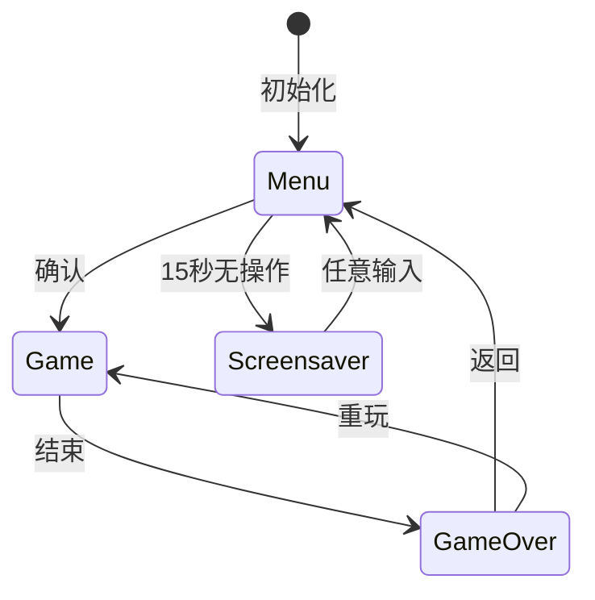

# 06 — 游戏控制台

## 架构

Game descriptor 模式，三状态状态机。



## 游戏描述符

```c
typedef struct {
    const char* name;          // 显示名称（最多 8 字符）
    Game_icon icon;            // 菜单图标枚举
    Game_id id;                // 唯一标识符
    void (*init)(const Game_hardware* hw);
    Game_result (*update)(const Game_input* input);
    uint32_t (*get_score)(void);
    uint8_t (*is_finished)(void);
} Game_descriptor;
```

`Game_hardware` = `{ St7789* lcd; Buzzer* buzzer; }`。
`Game_input` = `{ direction, direction_pressed, confirm_pressed, back_requested }`。

添加游戏：实现 4 个函数 → 添加枚举 → 注册描述符 → 绘制图标。详见 [10_developer_guide.md](10_developer_guide.md)。

## 输入系统

摇杆（ADC X/Y）→ 归一化 [-1.0, 1.0] → `game_direction_{up,left,down,right,none}`。

按键（GPIO）：
- 短按（<1s）→ 确认
- 长按（≥1s）→ 返回

方向变化仅触发一次（`direction_pressed = new_direction != last_direction`），防止按住时重复触发。

## 菜单

每页 3×2 网格，翻页带回绕。每个格子：图标（程序化绘制）+ 名称 + 最高分。方向键导航，边缘翻页。

## 游戏结束流程

提示（"输入名称" / "跳过"）→ 键盘（6×6 字符 + 删除/保存）→ 排行榜（前 10 名，重玩/菜单）。

分数持久化通过 `Score_Store` → LittleFS `"scores"` 文件。

## 屏保

菜单中 15 秒无操作 → 彩色管道垂直爬行（xorshift 伪随机数，18% 转弯概率，最大 250 步，无缝重生）。

## 音频

`buzzer_sfx_library[]` 中 35 个预定义音效。菜单事件 + 16 个游戏专属类别。`Buzzer_Play_Sfx(obj, sfx_idx)`。

## 渲染

直接 framebuffer 通过 `Game_Graphics` 原语——无 LVGL 控件开销。`Fill_Rect`、`Draw_Text`、`Draw_U32`、`Draw_Bitmap`、`Draw_Gray4_Bitmap`、`Draw_Pal4_Bitmap`。

## 任务

优先级 1，1024 字栈，20ms 周期（50 FPS 目标）。

## 关键文件

| 文件 | 角色 |
| --- | --- |
| `game_console.c` | 输入轮询、状态分发、初始化 |
| `game_registry.c` | 静态游戏描述符表 |
| `game_graphics.c` | 渲染原语 |
| `game_over_menu.c` | 三阶段游戏结束流程 |
| `score_store.c` | LittleFS 分数持久化 |
| `screensaver.c` | 管道轨迹屏保 |
