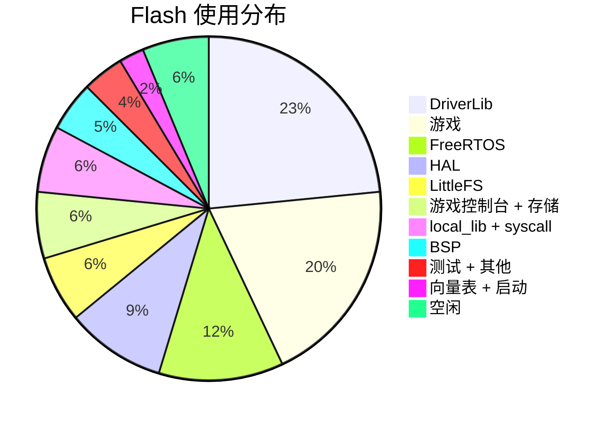

# 12 — 内存布局

## 链接脚本

`ti_device/.../mspm0g3507.lds`：

| 区域 | 起始地址 | 大小 |
| --- | --- | --- |
| FLASH | 0x00000000 | 128 KB |
| SRAM | 0x20200000 | 32 KB |
| 最小堆（newlib） | — | 1 KB |
| 最小栈 | — | 128 B |

## Flash（128 KB）



## RAM（32 KB）

| 区域 | 大小 | 内容 |
| --- | --- | --- |
| .data + .bss | ~3 KB | 全局/静态变量 |
| newlib 堆 | 1 KB | `_sbrk` 区域 |
| FreeRTOS 堆（heap_4） | 18 KB | 任务、HAL 对象、队列、信号量 |
| LFS 缓冲区（静态） | 528 B | 读 256B + 写 256B + 预读 16B |
| 系统栈 | 128 B | ISR + 启动 |

### FreeRTOS 堆明细

| 分配 | 大小 |
| --- | --- |
| Game 任务栈 | 4 KB（1024 字） |
| Flash Manager 任务栈 | 4 KB（1024 字） |
| Gpio_Task 栈 | 512 B（128 字） |
| Buzzer_Task 栈 | 512 B（128 字） |
| Timer 任务栈 | 512 B（128 字） |
| HAL 对象（ST7789、W25Q32 等） | ~500 B |
| 队列 + 信号量 | ~2 KB |
| 空闲/余量 | ~2 KB |

## 任务栈

| 任务 | 栈 | 高水位 | 余量 |
| --- | --- | --- | --- |
| Game_Console | 4096 B | ~3072 B | 25% |
| Flash_Mgr | 4096 B | ~3584 B | 12% |
| Gpio_Task | 512 B | ~320 B | 37% |
| Buzzer_Task | 512 B | ~256 B | 50% |

通过 `uxTaskGetStackHighWaterMark(NULL)` 验证。`configCHECK_FOR_STACK_OVERFLOW=2`。

## W25Q32 外部 Flash（4 MiB）

```
0x000000 – 0x1FFFFF（2 MiB）：裸 Flash（游戏素材、背景缓存）
0x200000 – 0x3FFFFF（2 MiB）：LittleFS（分数、存档数据）
```

## 启用 LVGL 时

额外约 45 KB Flash + 约 15-30 KB RAM（显示缓冲区）。当前禁用；游戏控制台使用直接渲染。

## 体积优化技术

- `-ffunction-sections -fdata-sections` + `-Wl,--gc-sections`：死代码消除
- `--specs=nano.specs`：newlib-nano
- 静态 LFS 缓冲区：无堆碎片
- 编译期配置：未用模块零代码产出
- 直接 framebuffer 渲染：无 LVGL 控件/RAM 开销
